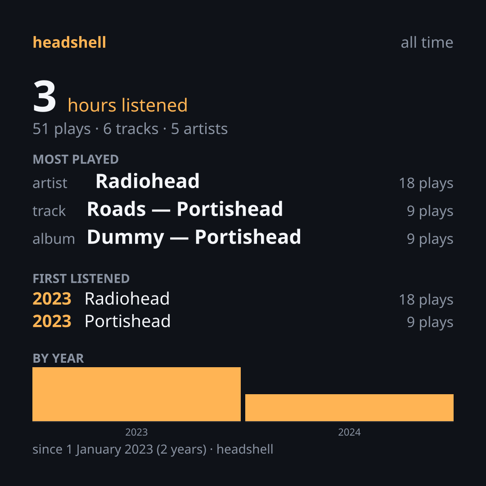

<div align="center">


# headshell

### Where the music comes from changes. **Your listening identity stays with you.**

<p align="center">
  A music layer that sits <i>above</i> the providers: your history, your statistics and<br>
  your taste in music live on your machine, not on a company's server.
</p>

[](LICENSE-MIT)
[](https://www.rust-lang.org)
[](#install)
[](#install)

**[What it does](#what-it-does)** · **[Install](#install)** · **[How to use it](#how-to-use-it)** · **[Where it plays from](#where-it-plays-from)** · **[Privacy](#privacy)** · **[Roadmap](#roadmap)**

<sub><b>English</b> · <a href="README.tr.md">Türkçe</a></sub>

<br>



<sub><i>Not once a year, but whenever you like. Any year you like.</i></sub>

</div>

---

## You listened for years. So whose history is it?

You spend ten years on a streaming service; every play, every discovery, that
song you played over and over at 3 a.m. gets recorded. Then you cancel the
subscription, and all of it stays behind. Ten years of listening identity turns
into an account screen you can't take with you.

**`headshell` turns this relationship around.** It brings your history down to
your own machine, gathers it under a single canonical identity, and keeps the
layer on top the same wherever you play the music from — your local disk, the
server at home, a plugin. That's where the name comes from: a turntable's
headshell doesn't choose the record, it reads whatever you put on.

|  | Streaming service | `headshell` |
| :--- | :--- | :--- |
| **Where your history is** | On the company's server | On your own disk, in an SQLite file |
| **How far back it goes** | As long as the subscription lasts | As far as the export covers — a lifetime |
| **Year-end card** | Once a year, the last 12 months (Spotify Wrapped®) | Whenever you like, any year, all time |
| **Where the music comes from** | A single catalog | Local files, Subsonic, Jellyfin, plugins |
| **Telemetry** | Yes | None — not a single line of it in the code |
| **Network** | Required | Optional; nobody is asked unless you say `--online` |

---

## What it does

### 📥 Brings your history in — no API, no sharing

It reads the data export Spotify provides under the GDPR. It asks for no
password and no API key, and it doesn't connect to your account. It reads a
file that is legally yours, and that's all.

```bash
headshell import my_spotify_data.zip
```

### 🔗 Gathers every copy of the same track under one identity

Your local FLAC, your copy on Jellyfin and the upload on SoundCloud — all three
are the same song. `headshell` matches them with a four-link chain: **ISRC →
MusicBrainz → fuzzy match → AcoustID fingerprint.** Every match carries a
confidence score, and the ones that don't match are **counted** — they don't
silently disappear.

### 📊 Your statistics, whenever you like

```text
$ headshell stats --year 2024 --top 3

period: 2024
4128 plays · 271.3 hours · 1163 tracks · 402 artists
4310 records in scope, 182 short plays skipped, 0 records out of scope, 37 records without an identity

top artists
   1. Pink Floyd                         312 plays   28h 41m  47 tracks
   2. Radiohead                          268 plays   21h 12m  53 tracks
   3. Daft Punk                          193 plays   14h 55m  31 tracks

top tracks
   1. Pink Floyd - Time                               38 plays    4h 21m
   2. Radiohead - Weird Fishes/Arpeggi                29 plays    2h 34m
   3. Daft Punk - Digital Love                        27 plays    2h 10m
```

<sub>The numbers are an example; the format is exactly what the program prints.
Note the third line: skipped records and records without an identity are
reported <b>as counts</b> — this project treats "I didn't look" and "I couldn't
find it" as different diagnoses.</sub>

### 🎨 A shareable Sleeve card

Square (1080×1080) or story (1080×1920), SVG or PNG. No need to wait for
December; you pick the year.

```bash
headshell sleeve --year 2024 --format story --out 2024.png
```

### 🎧 And it plays

From your local files, your Subsonic/Navidrome/Jellyfin server at home, and
plugins. The library is indexed with SQLite FTS5, so search answers instantly.

```bash
headshell play "Pink Floyd" --all --tui
```

```text
┌ headshell ─────────────────────────────────────────────────────────────────┐
│ ▶ Pink Floyd - Time  (playing)                                             │
└────────────────────────────────────────────────────────────────────────────┘
┌────────────────────────────────────────────────────────────────────────────┐
│████████████████████████████    2:45 / 6:53                                 │
└────────────────────────────────────────────────────────────────────────────┘
┌ queue (4) · repeat: all · shuffle: on ─────────────────────────────────────┐
│   Pink Floyd - Speak to Me                                                 │
│   Pink Floyd - Breathe (In the Air)                                        │
│ ▸ Pink Floyd - Time                                                        │
│   Pink Floyd - The Great Gig in the Sky                                    │
└────────────────────────────────────────────────────────────────────────────┘
 space pause · n/b next/previous · ↑↓ select · enter play · s shuffle · r repeat · q quit
```

### 🖥️ The same on the desktop

The queue, search, statistics, sleeve, and provider and plugin management, all
in one window. Drag the export archive onto the window and drop it. Press
<kbd>?</kbd> to see the shortcuts.

The interface supports **CSS themes that users can write**: 14 semantic
tokens, a versioned contract, two reference themes.
→ [theme writing guide](crates/headshell/themes/README.md)

---

## Install

> ### ⚠️ What beta means
>
> The core capabilities work and are covered by **466 tests**, but no release
> has yet lived anywhere beyond your own machine. The export file you import is
> never touched, so no data loss is expected — but the library schema may
> change between releases.

**Desktop packages** (`.deb`, `.rpm`, `.AppImage`, `.dmg`, `.msi`) are built for
every release tag and added to the [releases page](https://github.com/headshell/headshell/releases).
The macOS and Windows packages are unsigned: on macOS, right-click → Open; on
Windows, SmartScreen → Run anyway.

**How much has been tested on which system** — "it works" and "it builds" are
different things, and the table keeps them apart:

| System | Ready package | Status |
|---|---|---|
| Linux x86_64 | `.deb`, `.rpm`, AppImage, CLI archive, AUR | **Tested** — CI on every change; in real use, audio playback included |
| Windows 10/11 x64 | `.msi`, setup `.exe`, CLI archive | **Builds and tests in CI** (D-070); not tried by hand on a real desktop |
| macOS, Apple Silicon and Intel (universal binary) | `.dmg`, CLI archive | **Builds and tests in CI** on Apple Silicon (D-070); Intel only builds; not tried by hand |
| Linux aarch64, musl (Alpine) | none — from source | **Not tried** — expected to build |
| FreeBSD, NetBSD, OpenBSD, DragonFly | none — from source | **Not tried (canary)** — building needs `libclang`; whether audio and the desktop shell work there is unknown |

The lowest glibc the ready Linux packages need is **2.35** (Ubuntu 22.04,
Debian 12, Fedora 36 and later). `v0.0.1-beta` was built on Ubuntu 24.04 and
needs **2.39** — it doesn't open on Debian 12; from the next release on, the
packages are built on 22.04.

The data directory (library, plugins, settings) lives in each system's own
place; `HEADSHELL_DATA_DIR` comes first on all of them, and `headshell diag`
prints the one in use:

| System | Data directory |
|---|---|
| Linux, BSD | `~/.local/share/headshell` (under `$XDG_DATA_HOME` if it is set) |
| macOS | `~/Library/Application Support/headshell` |
| Windows | `%LOCALAPPDATA%\headshell` |

**Arch Linux** — the AUR has two flavours; the `-bin` ones don't wait for a
build:

```bash
paru -S headshell          # desktop, builds from source
paru -S headshell-cli      # command line
paru -S headshell-bin      # the same, prebuilt
paru -S headshell-cli-bin  # the CLI, prebuilt
```

**From source:**

```bash
git clone https://github.com/headshell/headshell.git
cd headshell
cargo build --release

cp target/release/headshell ~/.local/bin/   # command line
cargo run -p headshell                      # desktop window
```

<details>
<summary><b>Build requirements</b></summary>

<br>

Rust 1.87+ (2024 edition) and a C compiler (SQLite and the plugin engine are
compiled from source). On Linux, the desktop shell also needs
`libwebkit2gtk-4.1-dev`, `libgtk-3-dev`, `libasound2-dev`, `librsvg2-dev` and
`patchelf`. On Windows the MSVC toolchain is enough, and on macOS the Xcode
command line tools. The BSDs also need `libclang` (the plugin engine's bindings
are generated at build time there).

The ready Linux packages are built **on Ubuntu 22.04**: a binary doesn't open
on a system whose glibc is older than the one it was built on. If you build it
yourself, the binary may not open on systems older than the machine you built
it on.

**You don't need to install anything** for plugins. The plugin engine (QuickJS)
ships inside `headshell`. `headshell plugin install <name>` downloads the plugin
from the [catalog](https://github.com/headshell/plugins), and the engine
installs the tools it needs (yt-dlp for YouTube Music) — your platform's
self-contained binary, from a pinned version, with its sha256 verified, into
your data directory. No Python, no `pip`, no root.

</details>

---

## How to use it

<details>
<summary><b>How do you request your Spotify data?</b> (click)</summary>

<br>

1. Spotify → **Account → Privacy settings**
2. Tick **"Extended streaming history"** and request it
3. Within a few days a download link arrives in your email

This is a GDPR right; Spotify has to provide it, and you don't need an API key
for it.

</details>

```bash
# 1 — bring your history in
headshell import my_spotify_data.zip

# 2 — see what it says
headshell stats --year 2024 --top 10

# 3 — make your card
headshell sleeve --year 2024 --out 2024.png

# 4 — connect your music and play
export HEADSHELL_MUSIC_DIRS=~/Music
headshell provider scan
headshell play "Portishead" --all --tui
```

Connecting a remote server:

```bash
headshell provider add subsonic --url https://music.example.com --user alex --name home
headshell provider add jellyfin --url https://jf.example.com --user alex
headshell provider test home
```

If something goes wrong:

```bash
headshell diag     # the last run's environment, stage and error chain — one block
```

<details>
<summary><b>All commands</b></summary>

<br>

| Command | What it does |
| :--- | :--- |
| `headshell import <zip\|dir>` | Imports an export archive |
| `headshell stats [--year N] [--top N]` | Listening statistics |
| `headshell sleeve [--year N] [--format square\|story]` | Makes a shareable card |
| `headshell resolve "<artist> - <title>"` \| `--file <audio>` | Runs one track through the identity chain |
| `headshell library search <query>` | Full-text search in the library |
| `headshell play <query> [--all] [--shuffle] [--tui]` | Plays |
| `headshell provider list \| test \| scan \| add \| remove \| servers` | Provider management |
| `headshell plugin catalog \| install \| update \| remove` | The plugin catalog: list, install, update, remove |
| `headshell plugin list \| approve \| disable \| enable \| forget` | Installed plugins and their approvals |
| `headshell secret list \| set \| remove` | The secret store (values are never shown) |
| `headshell diag` | Diagnostics report |

Every command supports `--json`:

```bash
headshell stats --year 2024 --json | jq '.report.top_artists[0]'
```

</details>

---

## Where it plays from

| Source | Status | Note |
| :--- | :--- | :--- |
| **Local files** | ✅ In the core | FLAC, MP3, OGG/Vorbis, M4A/AAC |
| **Subsonic / Navidrome** | ✅ In the core | Verified against a real server |
| **Jellyfin** | ✅ In the core | Verified against a real server |
| **SoundCloud** | ✅ Plugin | Needs nothing |
| **YouTube Music** | ✅ Plugin | The engine downloads yt-dlp's platform binary and verifies its sha256 |
| **Torrent (Torznab)** | ⏸️ Parked | Written for the old plugin protocol; will move to the new engine later |
| **Spotify playback** | ❌ None | And there won't be — importing already works from the export file |

Plugins are written in JavaScript and run in the **QuickJS** engine embedded in
`headshell`: no Python, Node or other runtime is needed on the user's machine.
Every plugin declares what it will access and asks for your approval — and the
declaration is **enforced**: a plugin can only connect to the addresses it
declared, and it cannot access the file system. A plugin that hangs or fails
doesn't bring the app down.

Plugins live in a separate repository, the [**`headshell/plugins`**](https://github.com/headshell/plugins)
catalog; the app reads the list from there:

```bash
headshell plugin catalog              # what's available, what's installed, what can be updated
headshell plugin install soundcloud   # downloads it and verifies every file's sha256
headshell plugin approve soundcloud   # an installed plugin waits for your approval
headshell plugin update               # updates the ones installed from the catalog
```

The catalog is read only when you ask. It never writes an update over a plugin
you installed or changed by hand.
→ [plugin writing guide](docs/writing-plugins.md)

---

## Privacy

* **No telemetry.** There is no such thing in the code; you can search for it.
* **The network is off by default.** Unless you say `--online`, identity
  resolution asks no service. Importing an export doesn't silently connect you
  to the network. The plugin catalog, too, is read only when you say
  `plugin catalog`, `install` or `update` — nothing asks "is there an update?"
  in the background at startup.
* **Your password is never written to disk.** Nor is it typed on the command
  line (it would leak into the shell history and the `ps` output). For Subsonic
  a token is derived from it; for Jellyfin an access key is obtained; those are
  what is stored.
* **But no encryption is promised:** the derived token stands in for the
  password on that server, and it sits in `servers.json` as plain text with
  `0600` permissions. The protection is as good as the file permission — not
  against someone who has access to your disk.

---

## Roadmap

- [x] **Identity & statistics** — importing, the canonical identity chain, SQLite, the statistics engine
- [x] **Sleeve** — SVG/PNG card, square and story
- [x] **Playback** — local files, Subsonic, Jellyfin, a scrobbler, a TUI
- [x] **Plugins** — an embedded QuickJS engine, enforced permissions, two providers, AcoustID fingerprinting
- [x] **Desktop** — a Tauri interface and a versioned CSS theme contract
- [ ] **Rooms** — listening together in sync; audio is never relayed, only a time anchor is shared
- [ ] **Social graph** — friendships aren't declared, they're derived from listening together
- [ ] **Mobile** — iOS and Android through `uniffi`

---

## FAQ

<details>
<summary><b>Do I have to give my Spotify password or an API key?</b></summary>
<br>
No. <code>headshell</code> never connects to the Spotify API. It reads, locally,
the export zip you requested under the GDPR — a right the provider can't
restrict with its developer terms.
</details>

<details>
<summary><b>If I delete a music file, does my listening history go with it?</b></summary>
<br>
No. "What you listened to" and "what you can play right now" live in separate
tables. Delete the file, shut the server down or remove a plugin — your history
and statistics stay where they are.
</details>

<details>
<summary><b>Does it work without the internet?</b></summary>
<br>
Yes. Importing, local playback, statistics and sleeve generation work entirely
offline. The network is needed only for remote servers, plugins, the plugin
catalog and the identity links turned on with <code>--online</code>.
</details>

<details>
<summary><b>Why yet another "music app"?</b></summary>
<br>
Because this isn't a music app but a <b>listening identity</b> layer. The audio
source beneath it can change — in fact, it's expected to. What doesn't change is
where the record of who listened to what is kept.
</details>

---

## Contributing

Bug reports, suggestions and patches are welcome. The developer rules and test
steps: [`CONTRIBUTING.md`](CONTRIBUTING.md)

```bash
cargo test --workspace
cargo clippy --workspace --all-targets -- -D warnings
cargo fmt --all
```

No change counts as "done" until all three pass clean.

## License

**MIT** ([LICENSE-MIT](LICENSE-MIT)) **or** **Apache-2.0**
([LICENSE-APACHE](LICENSE-APACHE)) — whichever you prefer.
