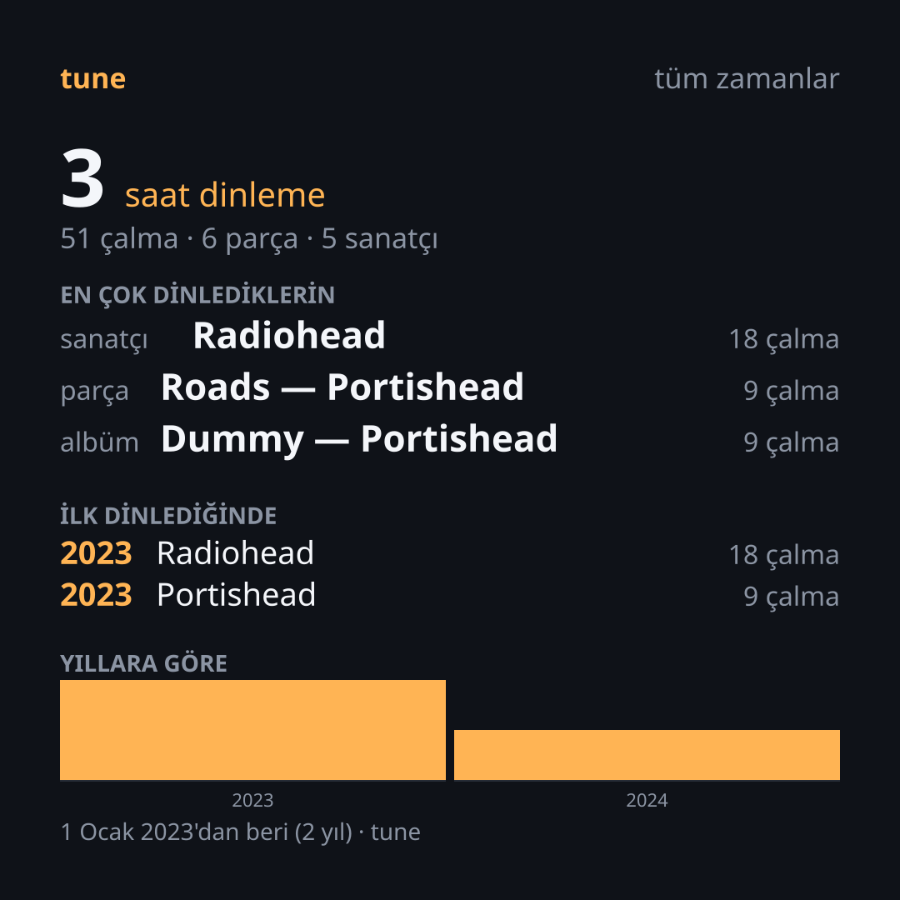

# tune (u-tune) 🎵

> **Sağlayıcıdan bağımsız dinleme kimliği ve müzik katmanı.**  
> Dinleme geçmişiniz, istatistikleriniz ve kütüphaneniz artık akış servislerinin tekelinde değil; tamamen **size** ait.

[](LICENSE-MIT)
[](https://www.rust-lang.org)
[](PLAN.md)

<p align="center">
  
</p>

---

## 💡 tune Nedir ve Neden Var?

Yıllardır müzik dinliyorsunuz; ancak dinleme geçmişiniz, oluşturduğunuz çalma listeleri ve müzik zevkinizin istatistikleri abone olduğunuz platformların sunucularında kilitli tutuluyor. Aboneliğinizi sonlandırdığınız veya başka bir servise geçtiğiniz gün, 10 yıllık müzik geçmişiniz sizinle gelmiyor. Yılda bir kez sunulan "Wrapped" özetleri ise yalnızca son 12 ayı kapsıyor.

**`tune` bu dinleme kaydını size geri verir:**

* **Ürün ses akışı değil, dinleme kimliğinizdir:** Müziğin nereden geldiği (yerel FLAC/MP3 dosyalarınız, Navidrome/Subsonic veya Jellyfin sunucunuz) değişse bile kimliğiniz, geçmişiniz ve istatistikleriniz tek bir çatı altında birleşir.
* **Geçmiş ve Bugün Tek Zaman Çizelgesinde:** Spotify gibi platformlardan yasal GDPR hakkınızla aldığınız tüm geçmişinizi içe aktarır. `tune` üzerinden müzik dinledikçe yeni dinlemeleriniz de (scrobble) aynı yerel veritabanına eklenir.
* **Tüm Yılların Wrapped Kartları:** Yalnızca son yılı değil, geçmiş tüm yıllarınızı veya arşivinizin tamamını kapsayan, sosyal medyada paylaşıma hazır yüksek kaliteli (PNG/SVG) Wrapped kartları üretir.
* **%100 Yerel ve Güvenli:** Verileriniz harici bir sunucuya gönderilmez; bilgisayarınızdaki SQLite veritabanında saklanır.

---

## ✨ Öne Çıkan Özellikler

- 📦 **Kolay Veri İçe Aktarma (Import):** Spotify genişletilmiş dinleme geçmişi (`Streaming_History_Audio_*.json`) zip arşivlerini doğrudan içe aktarın.
- 🎯 **Akıllı Parça Çözümleme (Kanonik Kimlik):** Şarkıları platformlardan bağımsız kimliklerle (ISRC, MusicBrainz ID, bulanık başlık/sanatçı eşleştirme) eşler; farklı platformlardaki aynı parçaları tekilleştirir.
- 📊 **Kapsamlı Dinleme İstatistikleri:** Yıl bazlı veya tüm zamanlar için en çok dinlenen sanatçılar, albümler, şarkılar, toplam dinleme süresi ve keşif zaman çizelgesi.
- 🎨 **Sosyal Medyaya Hazır Wrapped Kartları:** Kare (1080×1080) veya Hikaye/Story (1080×1920) formatlarında görsel kart çıktısı (SVG ve PNG).
- 🎧 **Yerel ve Uzak Müzik Oynatma:**
  - **Yerel Arşiv:** FLAC, MP3, OGG, M4A/AAC ve WAV formatlarını otomatik tarar, etiketlerini okur ve indeksler.
  - **Uzak Sunucular:** Subsonic / Navidrome ve Jellyfin sunucularınıza bağlanarak doğrudan akış (streaming) yapar.
- 🖥️ **Zengin Terminal Arayüzü (TUI):** Tuş kısayollarıyla şarkı değiştirme, duraklatma, arama, kuyruk yönetimi, karıştırma (shuffle) ve tekrar (repeat) kipleri.
- 🔒 **Güvenlik Odaklı Mimari:** Parolalar terminal geçmişine veya diske düz metin olarak kaydedilmez. Ses asla üçüncü taraf sunuculardan röle edilmez.
- 🛠️ **Gelişmiş Tanılama (`tune diag`):** Bir sorun yaşandığında hatanın hangi aşamada olduğunu şeffafça gösterir; veri kaybını önler.
- 🤖 **Tam JSON Desteği:** Tüm komutlar `--json` bayrağını destekler, böylece kendi betiklerinizle veya harici araçlarla kolayca entegre edilebilir.

---

## 🚀 Hızlı Başlangıç

### 1. Kurulum

Sisteminizde **Rust 1.85+** kurulu olmalıdır:

```bash
# Depoyu klonlayın
git clone https://github.com/kullanici-adi/tune.git && cd tune

# Release modunda derleyin
cargo build --release

# Çalıştırılabilir dosya: target/release/tune
# İsteğe bağlı olarak PATH'inize ekleyebilirsiniz:
cp target/release/tune ~/.local/bin/
```

---

### 2. Adım Adım Kullanım

#### Adım 1: Dinleme Geçmişinizi İçe Aktarın
Spotify hesabınızdan (*Hesap → Gizlilik → Genişletilmiş akış geçmişi*) verilerinizi talep edin (GDPR veri hakkı). İndirdiğiniz zip dosyasını `tune`'a verin:

```bash
tune import my_spotify_data.zip
```

#### Adım 2: İstatistiklerinizi İnceleyin
```bash
# Tüm zamanların istatistikleri
tune stats

# Belirli bir yılın en çok dinlenen ilk 20 sanatçı/parçası
tune stats --year 2024 --top 20
```

#### Adım 3: Paylaşılabilir Wrapped Kartınızı Üretin
Sosyal medyada paylaşmak üzere şık bir kart oluşturun:

```bash
# Kare formatında (1080x1080) PNG çıktısı
tune wrapped --year 2024 --out 2024-wrapped.png

# Hikaye / Story formatında (1080x1920) PNG çıktısı
tune wrapped --year 2024 --format story --out 2024-story.png

# Vektörel SVG olarak kaydetmek için
tune wrapped --year 2024 --out 2024-wrapped.svg
```

---

### 3. Müzik Dinleme ve Kütüphane Yönetimi

#### Yerel Müzik Klasörlerini Kullanma
Müzik klasörünüzü belirtin ve kütüphanenizi indeksleyin:

```bash
# Müzik klasörünüzü tanımlayın (varsayılan: ~/Music veya ~/Müzik)
export TUNE_MUSIC_DIRS=~/Müzik

# Müzik dosyalarını bir kez tarayın (indeks kalıcıdır)
tune provider scan

# Kütüphanenizde arama yapın
tune library search "Pink Floyd"

# Terminal arayüzü (TUI) ile müzik çalın
tune play "Comfortably Numb" --tui
```

#### Uzak Sunucu Ekleme (Navidrome / Subsonic / Jellyfin)
Kendi kişisel müzik sunucunuzu bağlayın:

```bash
# Subsonic / Navidrome sunucusu ekleme:
tune provider add subsonic --url https://muzik.sunucum.com --user kullaniciadi --name ev

# Jellyfin sunucusu ekleme:
tune provider add jellyfin --url https://jf.sunucum.com --user kullaniciadi

# Kayıtlı sunucuları listeleme ve durumunu test etme:
tune provider servers
tune provider test ev

# Uzak sunucudaki bir şarkıyı arayıp çalma:
tune play "Daft Punk" --all --tui
```

> 🔐 **Güvenlik Notu:** Parolanız komut satırına yazılmaz (böylece terminal geçmişine düşmez). Komutu çalıştırdığınızda yankısız olarak sorulur veya `TUNE_PASSWORD` ortam değişkeninden güvenle okunur.

---

## ⌨️ Terminal Arayüzü (TUI) Kısayolları

`tune play "<arama>" --tui` komutunu çalıştırdığınızda açılan arayüzü aşağıdaki tuşlarla yönetebilirsiniz:

| Tuş | İşlev |
| :--- | :--- |
| <kbd>Boşluk</kbd> / <kbd>p</kbd> | Oynat / Duraklat |
| <kbd>n</kbd> / <kbd>b</kbd> | Sonraki parça / Önceki parça |
| <kbd>↑</kbd> <kbd>↓</kbd> veya <kbd>k</kbd> <kbd>j</kbd> | Çalma listesinde (kuyrukta) gezinme |
| <kbd>Enter</kbd> | Seçili parçayı hemen çal |
| <kbd>s</kbd> | Karıştırma modunu aç / kapat (Shuffle) |
| <kbd>r</kbd> | Tekrar modunu değiştir (Kapalı → Tümü → Tek Parça) |
| <kbd>q</kbd> / <kbd>Esc</kbd> | Oynatıcıdan çık |

---

## 📖 Komut Satırı Referansı

| Komut | Açıklama | Örnek |
| :--- | :--- | :--- |
| `tune import <dosya>` | Veri export zip arşivini veya dizinini içe aktarır | `tune import export.zip` |
| `tune stats` | Dinleme istatistiklerini listeler | `tune stats --year 2024 --top 15` |
| `tune wrapped` | Paylaşılabilir görsel Wrapped kartı üretir | `tune wrapped --format story --out kart.png` |
| `tune play <sorgu>` | Kütüphaneden parça arar ve çalar | `tune play "queen" --all --shuffle --tui` |
| `tune library search <sorgu>` | Yerel ve uzak kütüphanede tam metin arama yapar | `tune library search "bohemian"` |
| `tune provider list` | Mevcut müzik sağlayıcılarını listeler | `tune provider list` |
| `tune provider scan` | Yerel müzik klasörlerini artımlı olarak tarar | `tune provider scan` |
| `tune provider add` | Yeni bir Subsonic veya Jellyfin sunucusu ekler | `tune provider add subsonic --url https://...` |
| `tune provider servers` | Kayıtlı uzak sunucuları listeler | `tune provider servers` |
| `tune provider test <ad>` | Sağlayıcının bağlantısını ve parça sayısını sınar | `tune provider test local` |
| `tune resolve <sorgu>` | Bir parçanın kanonik kimlik çözümlemesini test eder | `tune resolve "Daft Punk - Get Lucky"` |
| `tune diag` | Son işlemin detaylı tanı ve hata raporunu görüntüler | `tune diag` |

> 💡 **İpucu:** Herhangi bir komutun sonuna `--json` ekleyerek çıktıyı JSON formatında alabilir ve `jq` gibi araçlarla filtreleyebilirsiniz.

---

## 🗺️ Yol Haritası

- [x] **Faz 0: Kimlik & İstatistik Katmanı** — Spotify export içe aktarma, SQLite depolama, istatistik motoru, kanonik kimlik eşleme.
- [x] **Faz 0.5: Paylaşılabilir Wrapped** — SVG/PNG kart üretimi (Kare ve Dikey Hikaye şablonları).
- [x] **Faz 1: Evrensel Oynatıcı** — Yerel dosya oynatma (FLAC, MP3 vb.), Subsonic/Jellyfin akışı, dahili scrobbling, TUI oynatıcı.
- [ ] **Faz 2: Eklenti Ekosistemi** — JSON-RPC tabanlı çok dilli eklenti desteği, parmak iziyle şarkı tanıma (AcoustID).
- [ ] **Faz 3: Modern Masaüstü Arayüzü (GUI) & Temalar** — Tauri tabanlı masaüstü uygulaması ve topluluk temaları.
- [ ] **Faz 4: Senkronize Odalar (Birlikte Dinleme)** — Ses akışı röle edilmeden, zaman çapasıyla arkadaşlarınızla eş zamanlı müzik dinleme.
- [ ] **Faz 5: Mobil Entegrasyon** — iOS ve Android için yerel istemciler (`uniffi`).

---

## 🤝 Katkıda Bulunma

Katkılarınızı memnuniyetle karşılıyoruz!
Detaylı geliştirici rehberi ve test yönergeleri için lütfen [`CONTRIBUTING.md`](CONTRIBUTING.md) dosyasına göz atın.

Projeyi yerelinizde test etmek için:
```bash
cargo test --workspace
cargo clippy --workspace --all-targets -- -D warnings
cargo fmt --all
```

---

## 📜 Lisans

Bu proje çift lisans altında sunulmaktadır:

* **MIT Lisansı** ([LICENSE-MIT](LICENSE-MIT))
* **Apache Lisansı, Sürüm 2.0** ([LICENSE-APACHE](LICENSE-APACHE))

Tercihinize göre istediğiniz lisansı kullanabilirsiniz.
