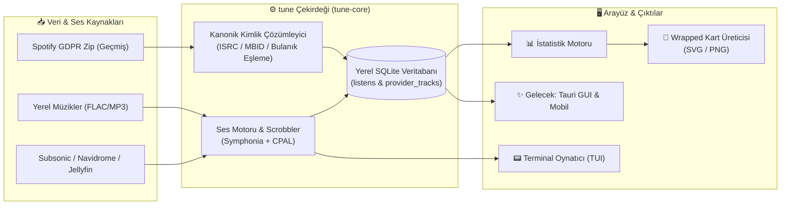

<div align="center">

```
  _                     
 | |_ _   _ _ __   ___  
 | __| | | | '_ \ / _ \ 
 | |_| |_| | | | |  __/ 
  \__|\__,_|_| |_|\___| 
                        
```

# tune (u-tune)
### *Sağlayıcıdan Bağımsız Dinleme Kimliği & Müzik Katmanı*

<p align="center">
  <strong>Müziğin nereden geldiği değişir, müzik zevkiniz ve geçmişiniz size kalır.</strong><br>
  Aboneliklere ve platform duvarlarına son veren açık kaynaklı kişisel müzik ekosistemi.
</p>

[](LICENSE-MIT)
[-orange.svg?style=for-the-badge&logo=rust)](https://www.rust-lang.org)
[](PLAN.md)
[](PLAN.md)
[](CONTRIBUTING.md)

<br>

<p align="center">
  
</p>

[ 🚀 Hızlı Başlangıç ](#-hızlı-başlangıç) • 
[ 💡 Neden tune? ](#-neden-tune) • 
[ ✨ Özellikler ](#-öne-çıkan-özellikler) • 
[ 🖥️ Terminal Arayüzü ](#-terminal-oynatıcı-tui-deneyimi) • 
[ 📖 Komutlar ](#-komut-satırı-kılavuzu) • 
[ 🗺️ Yol Haritası ](#️-yol-haritası) • 
[ ❓ SSS ](#-sıkça-sorulan-sorular-sss)

---

</div>

## 💡 Neden tune?

Yıllardır müzik dinliyorsunuz; ancak tüm dinleme geçmişiniz, çalma listeleriniz ve müzik kimliğiniz ticari akış servislerinin sunucularında kilitli tutuluyor. Aboneliğinizi sonlandırdığınız gün 10 yıllık müzik geçmişiniz elinizden kayıp gidiyor. Yılda bir kez gösterilen "Wrapped" özetleri ise yalnızca son 12 ayı ve platformun pazarlama hedeflerini yansıtıyor.

**`tune`, müziğiniz üzerindeki egemenliğinizi geri verir:**

| Karşılaştırma | Klasik Akış Servisleri | `tune` |
| :--- | :--- | :--- |
| **Veri Mülkiyeti** | 🔒 Şirketin sunucularında hapsolmuş veri | 🏠 **%100 sizin, yerel SQLite veritabanında** |
| **Dinleme Geçmişi** | ⏳ Yalnızca aktif abonelik boyunca erişilebilir | ♾️ **Ömür boyu, platformdan bağımsız arşiv** |
| **Wrapped & İstatistikler** | 📅 Yılda bir kez, sadece son 12 ay | 📊 **İstediğiniz an, istediğiniz yıl veya tüm zamanlar** |
| **Müzik Kaynağı** | 🚫 Yalnızca servisin kendi kataloğu | 🎧 **Yerel dosyalar (FLAC, MP3...), Navidrome, Subsonic, Jellyfin** |
| **Scrobbling** | ☁️ Üçüncü taraf servis şartlarına bağlı | ⚡ **Dahili scrobbler: Geçmiş ve bugün tek zaman çizelgesinde** |
| **Gizlilik & Güvenlik** | 👁️ Yoğun kullanıcı takibi ve telemetri | 🛡️ **Sıfır telemetri, tamamen çevrimdışı çalışabilirlik** |

---

## 🏗️ Nasıl Çalışır?



---

## ✨ Öne Çıkan Özellikler

### 📦 1. Eksiksiz Geçmiş İçe Aktarımı
* Spotify genişletilmiş dinleme geçmişinizi (`Streaming_History_Audio_*.json`) tek adımda içeri aktarır.
* Akıllı kimlik eşleme zinciri (**ISRC → MusicBrainz ID → Bulanık Metin Eşleştirme**) ile parçaları tekilleştirir.

### 📊 2. Sınırsız İstatistikler & Kişisel Wrapped
* Toplam dinleme süresi, en çok dinlenen sanatçılar, albümler, şarkılar ve keşif zaman çizelgeleri.
* Sosyal medyada doğrudan paylaşılabilecek **Kare (1080×1080)** ve **Hikaye (1080×1920)** ölçülerinde şık kartlar üretir.

### 🎧 3. Evrensel Müzik Çalar
* **Yerel Formatlar:** `FLAC`, `MP3`, `OGG`, `M4A/AAC`, `WAV` desteği.
* **Uzak Medya Sunucuları:** `Navidrome`, `Subsonic`, `Jellyfin` üzerinden doğrudan akış.
* **Kalıcı İndeks & Hızlı Arama:** Kütüphanenizi SQLite FTS5 tam metin aramasıyla anında tarar.

### 🖥️ 4. Güçlü Terminal Arayüzü (TUI)
* Donanımı yormayan, klavye dostu, modern bir terminal oynatıcı.

---

## 🚀 Hızlı Başlangıç

### 1. Kurulum

Sisteminizde **Rust 1.85+** (2024 edition) kurulu olmalıdır:

```bash
# 1. Depoyu klonlayın
git clone https://github.com/kullanici-adi/tune.git
cd tune

# 2. Optimize edilmiş sürümü derleyin
cargo build --release

# 3. İkili dosyayı sistem PATH'ine ekleyin (isteğe bağlı)
cp target/release/tune ~/.local/bin/
```

---

### 2. Adım Adım Kullanım

#### 📁 Adım 1: Spotify Geçmişinizi İçe Aktarın

<details>
<summary><b>🔍 Spotify'dan verinizi nasıl talep edersiniz? (Tıklayın)</b></summary>

1. Spotify web sitesinde **Hesap → Gizlilik ayarları** bölümüne gidin.
2. Sayfanın altındaki **"Verilerini indir"** bölümünden **"Genişletilmiş akış geçmişi"** kutusunu işaretleyin ve talep edin.
3. Spotify bir iki gün içinde indirme bağlantısını e-postanıza gönderecektir (Bu yasal bir GDPR hakkıdır).
</details>

İndirdiğiniz zip arşivini doğrudan `tune` ile içe aktarın:
```bash
tune import my_spotify_data.zip
```

#### 📈 Adım 2: İstatistiklerinizi Görüntüleyin
```bash
# Genel dinleme geçmişi özeti
tune stats

# Belirli bir yıla ait ilk 10 sanatçı ve parça
tune stats --year 2024 --top 10
```

```text
$ tune stats --year 2024 --top 3

📊 2024 Dinleme İpuçları (Toplam: 54,120 dk)
─────────────────────────────────────────────
🏆 En Çok Dinlenen Sanatçılar:
   1. Pink Floyd ─────── 12,450 dk (%23)
   2. Radiohead ────────  8,120 dk (%15)
   3. Daft Punk ────────  6,300 dk (%12)
```

#### 🎨 Adım 3: Wrapped Kartınızı Oluşturun
Sosyal medyada paylaşmak üzere yüksek çözünürlüklü görsel kartınızı üretin:

```bash
# Kare Formatı (Instagram / Twitter / Feed)
tune wrapped --year 2024 --out wrapped2024.png

# Dikey Hikaye Formatı (Instagram Story / Shorts - 1080x1920)
tune wrapped --year 2024 --format story --out story2024.png

# Vektörel Çıktı (SVG)
tune wrapped --year 2024 --out wrapped2024.svg
```

---

## 🎧 Müzik Çalma ve Kütüphane

### Yerel Dosyaları Çalma
Yerel müzik klasörlerinizi tek bir komutla indeksleyin ve çalın:

```bash
# Müzik dizininizi ayarlayın (varsayılan: ~/Müzik veya ~/Music)
export TUNE_MUSIC_DIRS=~/Müzik

# Kütüphaneyi tarayın (artımlı tarama, yalnızca değişenler güncellenir)
tune provider scan

# Arama yapın ve Terminal Arayüzü (TUI) ile çalın
tune play "Pink Floyd" --all --tui
```

### Uzak Sunucuları Bağlama (Navidrome / Subsonic / Jellyfin)

```bash
# Subsonic / Navidrome sunucusu ekleme:
tune provider add subsonic --url https://muzik.evim.com --user ahmet --name ev

# Jellyfin sunucusu ekleme:
tune provider add jellyfin --url https://jf.evim.com --user ahmet

# Kayıtlı sunucuları kontrol etme:
tune provider servers
tune provider test ev

# Uzak sunucudan parça çalma:
tune play "Get Lucky" --tui
```

> [!NOTE]
> **Güvenlik Güvencesi:** Parolanız komut satırına argüman olarak yazılmaz (kabuk geçmişine ve `ps` çıktısına sızmaz). Komut çalışırken yankısız sorulur veya `TUNE_PASSWORD` ortam değişkeninden okunur. Diskte şifrelenmiş anahtar/token olarak saklanır.

---

## 🖥️ Terminal Oynatıcı (TUI) Deneyimi

`tune play "<sorgu>" --tui` komutu zengin bir terminal arayüzü başlatır:

```text
┌─────────────────────────────── tune player ────────────────────────────────┐
│                                                                            │
│  ▸ Pink Floyd — Time [The Dark Side of the Moon]                           │
│  02:45 ━━━━━━━━━━━━━━━━━━━━━━●───────────────────────────── 06:53 (40%)    │
│                                                                            │
│  Kuyruk (3/10)                  [Karıştır: AÇIK]  [Tekrar: TÜMÜ]          │
│  ────────────────────────────────────────────────────────────────────────  │
│    1. Pink Floyd — Speak to Me                                   01:08     │
│    2. Pink Floyd — Breathe (In the Air)                          02:49     │
│  ▸ 3. Pink Floyd — Time                                          06:53     │
│    4. Pink Floyd — The Great Gig in the Sky                      04:47     │
│                                                                            │
│  [Boşluk] Duraklat  [n/b] Sonraki/Önceki  [s] Karıştır  [r] Tekrar  [q] Çık │
└────────────────────────────────────────────────────────────────────────────┘
```

### ⌨️ Klavye Kısayolları

| Kısayol | İşlev |
| :---: | :--- |
| <kbd>Boşluk</kbd> / <kbd>p</kbd> | Oynat / Duraklat |
| <kbd>n</kbd> / <kbd>b</kbd> | Sonraki parça / Önceki parça |
| <kbd>↑</kbd> <kbd>↓</kbd> ya da <kbd>k</kbd> <kbd>j</kbd> | Kuyrukta parça seçimi |
| <kbd>Enter</kbd> | Seçilen parçayı hemen başlat |
| <kbd>s</kbd> | Karıştırma modunu aç / kapat (*Shuffle*) |
| <kbd>r</kbd> | Tekrar modunu değiştir (*Kapalı → Tümü → Tek*) |
| <kbd>q</kbd> / <kbd>Esc</kbd> | Oynatıcıdan çık |

---

## 📖 Komut Satırı Kılavuzu

| Alt Komut | Seçenekler | Açıklama |
| :--- | :--- | :--- |
| `tune import <zip>` | | Spotify genişletilmiş geçmiş arşivini içe aktarır |
| `tune stats` | `--year <yıl>`, `--top <n>`, `--min-ms <ms>` | Detaylı dinleme istatistiklerini listeler |
| `tune wrapped` | `--year <yıl>`, `--format square\|story`, `--out <dosya>` | Paylaşılabilir görsel Wrapped kartı oluşturur |
| `tune play <sorgu>` | `--all`, `--shuffle`, `--dry-run`, `--tui` | Arama sonucundaki parçaları çalar |
| `tune library search` | `<sorgu>`, `--limit <n>` | Kütüphane içinde tam metin arama yapar |
| `tune provider scan` | | Yerel müzik klasörlerini tarar ve indeksler |
| `tune provider add` | `subsonic\|jellyfin`, `--url`, `--user`, `--api-key` | Yeni bir uzak müzik sunucusu kaydeder |
| `tune provider list` | | Etkin müzik sağlayıcılarını listeler |
| `tune provider test` | `<sağlayıcı-adı>` | Sağlayıcının erişim durumunu ve parça sayısını test eder |
| `tune plugin list` | | Kurulu eklentileri ve onay durumlarını listeler |
| `tune plugin approve` | `<eklenti-adı>` | Eklentinin beyan ettiği izinleri onaylar |
| `tune secret set` | `<ad-alanı> <anahtar>` | Sır yazar (değer istemden ya da `TUNE_SECRET`'ten) |
| `tune resolve` | `"<sanatçı> - <başlık>"` | Tek parçayı kanonik kimlik çözümleme zincirinden geçirir |
| `tune diag` | | Son işlemin ortam, aşama ve hata tanılama raporunu döker |

> [!TIP]
> Bütün komutlar `--json` parametresini destekler. Çıktıları `jq` veya kendi betiklerinizle kolayca işleyebilirsiniz:
> ```bash
> tune stats --year 2024 --json | jq '.report.top_artists[0]'
> ```

---

## 🗺️ Yol Haritası

- [x] **Faz 0: Kimlik & İstatistikler** — Veri içe aktarma, kanonik kimlik eşleme, SQLite depolama, istatistik motoru.
- [x] **Faz 0.5: Paylaşılabilir Wrapped** — SVG & PNG (1080x1080 / 1080x1920) görsel kart üretimi.
- [x] **Faz 1: Evrensel Müzik Çalar** — Yerel dosya oynatma, Navidrome & Jellyfin akışı, dahili scrobbler, TUI oynatıcı.
- [ ] **Faz 2: Eklenti Ekosistemi & Parmak İzi** — Alt süreç + JSON-RPC eklenti protokolü **tamam** ([eklenti yazma rehberi](docs/eklenti-yazma.md)); referans eklenti, AcoustID parmak izi ve torrent sağlayıcı sırada.
- [x] **Faz 3: Masaüstü Uygulaması (GUI) & Temalar** — Tauri tabanlı masaüstü arayüzü ve sürümlenmiş CSS tema sözleşmesi ([tema yazma rehberi](crates/tune/themes/README.md)).
- [ ] **Faz 4: Senkronize Odalar (Birlikte Dinleme)** — Ses akışı röle edilmeden zaman çapasıyla eşzamanlı dinleme.
- [ ] **Faz 5: Mobil İstemciler** — `uniffi` ile iOS ve Android desteği.

---

## ❓ Sıkça Sorulan Sorular (SSS)

<details>
<summary><b>Spotify şifremi veya API anahtarımı vermem gerekiyor mu?</b></summary>
<b>Hayır.</b> tune, Spotify API'sine veya şifrenize ihtiyaç duymaz. GDPR kapsamında talep ettiğiniz veri export zip dosyasını yerel olarak okur.
</details>

<details>
<summary><b>Bilgisayarımdan bir müzik dosyasını silersem dinleme geçmişim silinir mi?</b></summary>
<b>Asla.</b> tune mimarisinde "ne dinledin" (dinleme geçmişi) ile "şu an ne çalabilirsin" (katalog) tamamen ayrı tablolarda saklanır. Dosyayı silseniz dahi dinleme geçmişiniz ve istatistikleriniz kalıcıdır.
</details>

<details>
<summary><b>İnternet bağlantım olmadan çalışır mı?</b></summary>
<b>Evet.</b> tune tamamen yerel makinenizde çalışır. İçe aktarma, yerel oynatma, TUI ve istatistik üretimi için internet bağlantısı zorunlu değildir.
</details>

---

## 🤝 Katkıda Bulunma

`tune` açık kaynaklı ve topluluk odaklı bir projedir. Hata bildirimleri, yeni özellik önerileri ve katkılar memnuniyetle kabul edilir!

Geliştirici kuralları ve test adımları için lütfen [`CONTRIBUTING.md`](CONTRIBUTING.md) belgesini inceleyin.

```bash
# Test paketini çalıştırma
cargo test --workspace

# Kod stili ve clippy denetimleri
cargo clippy --workspace --all-targets -- -D warnings
cargo fmt --all
```

---

## 📜 Lisans

Bu proje özgür yazılım ilkelerine uygun olarak **çift lisans** altındadır:

* **MIT Lisansı** ([LICENSE-MIT](LICENSE-MIT))
* **Apache Lisansı, Sürüm 2.0** ([LICENSE-APACHE](LICENSE-APACHE))

Dilediğiniz lisans koşulları altında kullanabilir, dağıtabilir veya katkıda bulunabilirsiniz.
